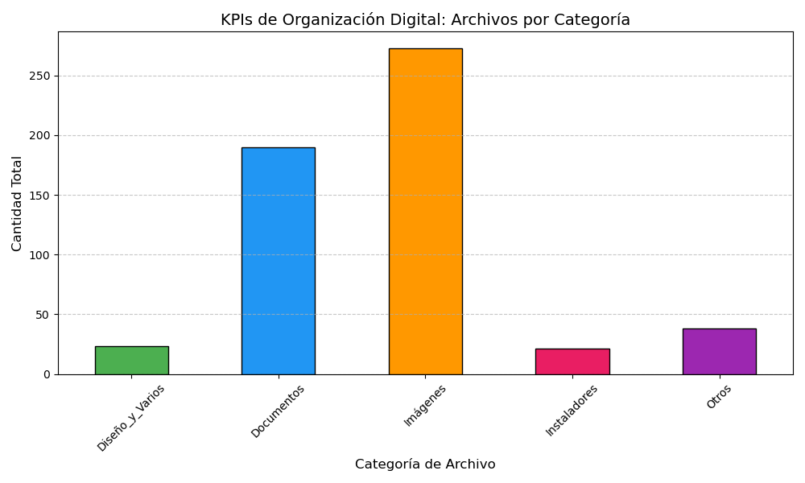

# Productivity-Automation-Dashboard

# Smart File Organizer & Business Intelligence Dashboard 🚀

## 📌 Visión General
Este proyecto nace de la necesidad de optimizar procesos administrativos y transformar el desorden digital en datos accionables (KPIs). Desarrollé un ecosistema en Python que automatiza la clasificación de archivos y visualiza el volumen de trabajo semanal.

**Impacto:** Automatización de tareas repetitivas y generación de métricas de productividad para la toma de decisiones.

## 🛠️ Tecnologías Utilizadas
* **Lenguaje:** Python 3.x
* **Librerías de Datos:** Pandas (Manipulación de datos), Matplotlib (Visualización).
* **Automatización:** OS, Pathlib, Shutil y Windows Task Scheduler.

## 📊 Características Principales
1. **Organizador Resiliente:** Clasifica automáticamente documentos, imágenes e instaladores evitando conflictos de sistema.
2. **Sistema de Logging:** Registra cada movimiento en un archivo CSV, creando un histórico de flujo de trabajo.
3. **Dashboard de KPIs:** Genera reportes visuales instantáneos para auditar la carga operativa semanal.

## 📈 Resultados
- Clasificación de más de **500 activos digitales** en segundos.
- Visibilidad clara de las áreas de mayor carga administrativa (ej. Facturación vs. Logística).

